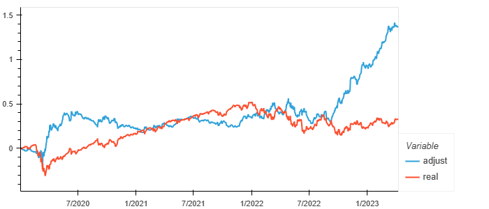
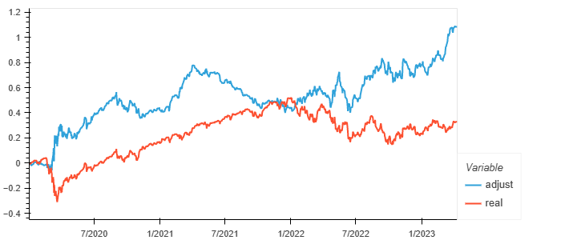

# S&P500_Predictor
Use machine learning to try and predict stock market movement. 

---

## About The Project

This application is designed predict the price action of the SPDR S&P 500 ETF Trust (SPY). This application looks at economic indicators and performs sentiment analysis to help investors make informed decisions about their investment choices.
+ Pulls S&P Financials
+ Generates key market ratios
+ Pulls economic indicators
+ Performs news sentiment analysis

Using the above inputs, the model is used to predict future S&P 500 movement.

---

## Installation

One version of the code is run on a pc with Windows 10.

This project leverages Python 3.9 with the following packages:

+ pandas
+ numpy
+ datetime
+ sklearn 
+ tensorflow
+ datetime 
+ matplotlib
+ yfinance
+ requests
+ os
+ scikit-learn
+ nltk
+ vaderSentiment

### Installation Guide (MacOS & Windows)

1.  Open a terminal or command prompt on your computer.
2.  Install all packages by running the commands: 

```bash
  pip install pandas
  pip install numpy
  pip install datetime
  pip install sklearn 
  pip install tensorflow
  pip install datetime 
  pip install matplotlib
  pip install yfinance
  pip install requests
  pip install os
  pip install scikit-learn
  pip install nltk
  pip install vaderSentiment
```

### APIs Needed

+ New York Times Archive API - access an API key using this link: https://developer.nytimes.com/get-started
+ [Insert other API here and link to access]

---

### Background
In the background the following python modules are running.

```bash
"vix_mod"
"spy_mod"
"econ_mod"
"sent_mod"
"create_train_test_mod"
"train_scale_mod"
"test_scale_mod"
"nn_model_mod"
"nn_class_model_mod"
```

vix_mod
>This plugin pulls historical vix data and pricing. Uses kmeans to label vix data as "high," "medium," and "low" volatility.

spy_mod
>This plugin pulls historical SPDR S&P 500 ETF Trust (SPY) data and generates market indicators and financial ratios.

econ_mod
>This plugin pulls economic data from the Federal Reserve Economic Data.

sent_mod
>This plugin pulls news headlines for the SPY and groups them by day. It then performs sentiment analysis to give a sentiment score betweeo -1 and 1 (-1 being most negative and 1 being most positive)

create_train_test_mod
>This module pulls the data gathered from the vix_mod, spy_mod, econ_mod and sent_mod and compiles them into a single table. In addition it also prepares the X and y tables needed for training and testing

train_scaled_mod
>This module scales the training data.

test_scaled_mod
>This module scales the testing data.

nn_model_mod
>This module call forth a neural network regression model. This model is trained and fit using the scaled training data. Due to the inconsistancy of nueral network models, the models are set in loops, which will end when certain training requirements are met.

nn_class_model_mod
>This module call forth a neural network classification model. This model is trained and fit using the scaled training data. Due to the inconsistancy of nueral network models, the models are set in loops, which will end when certain training requirements are met.
---

## Summary

Regardless of whether a regression or classification neural network model is used, the model often outperformed during times of high volatility.

### Investment Strategy
Both models use the idology that if an "up" day is predicted, the strategy is invested in 100% SPY, and if a "down" day is predicted, the portfolio is shorted at -50%. As a result, days where both models predict a downturn the portfolio takes a 100% short position. Days where the both models predict an "up" day the portfolio is leveraged at 100%, for 2x the return of SPY. When the models conflit the portfolio takes a defensive stance at a 50% exposure to SPY.

### Keras Regression Model



### Keras Classifier Model



---

## Contributors

* Michael Roth
* Diego Favela
* Jonny Cruz

---

## License
This program is licensed under the MIT License.